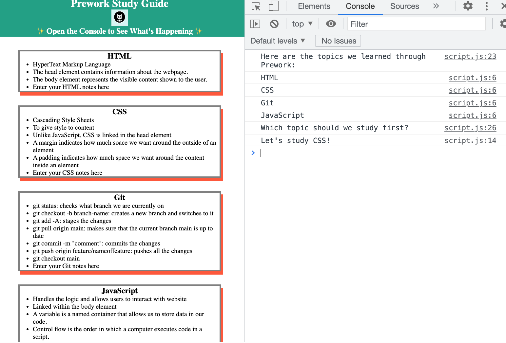

# Prework Study Guide Webpage

## Description

The website provides the notes taken for the prework study. This provides user notes taken for topics HTML, CSS, Git and JavaScript.

This project is built so that the user will have easy access to prework study notes from anywhere. This will streamline and make access for studying more convenient.

## Installation

N/A

## Usage

To use this Prework Study Guide, you can review the notes in each section. For suggestions on what to study first, open the Chrome DevTools by pressing Command+Option+I (macOS) or Control+Shift+I (Windows). A console panel should open either below or to the side of the webpage in the browser. There you will see a list of topics we learned from the prework along with a suggestion on which topic to study first.

## Credits

N/A

## License

Please refer to the license in the REPO (MIT)